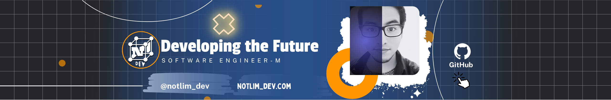

---

  
  
  
  
  
  
  
  
  
  
  
  
  
  
  
  
  
  
  

---

  
  
  
  
  

###

  
  

<picture>
  <source media="(prefers-color-scheme: dark)" srcset="https://raw.githubusercontent.com/maurodesouza/maurodesouza/output/pacman-contribution-graph-dark.svg">
  <source media="(prefers-color-scheme: light)" srcset="https://raw.githubusercontent.com/maurodesouza/maurodesouza/output/pacman-contribution-graph.svg">
  
</picture>

<h1 align="center">Hola 👋, soy Milton Vergara</h1>
<h3 align="center">Desarrollador fullstack y entusiasta de la ciencia de datos y la inteligencia de negocios</h3>

---

🌱 Actualmente estoy aprendiendo:

- Big Data con Databricks (PySpark, Delta Lake, MLflow)
- Visualización de datos (Plotly.js, Power BI, Looker Studio)
- Arquitecturas modernas con Flask + React
- Astro y frameworks modernos para portafolios interactivos

🧠 Tengo experiencia con:

- Python, TypeScript, Bash
- React, Next.js, Astro, Three.js
- Flask, FastAPI
- Docker, Git, Linux (Arch con Hyprland/BSPWM)

📊 Áreas de interés:

- Visualización de datos interactiva
- Machine learning aplicado a salud pública y educación
- Automatización y scripting en Linux
- Étical hacking (formación en curso)

🔗 Conecta conmigo:

---

📫 ¿Quieres colaborar en algo? ¡Envíame un mensaje!
